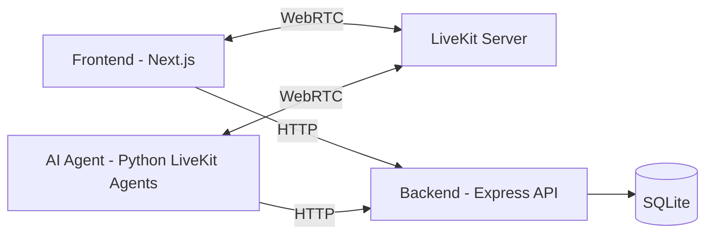

# SoulEye

SoulEye is a real-time, voice-first AI assistant designed to help users navigate their surroundings, read documents, and get help fast. It combines a Next.js accessibility-focused UI, a Node.js API for user sessions and history, and a Python LiveKit agent that handles speech, vision, and tool use.

## Highlights

- Live, bi-directional voice assistant using LiveKit
- Camera-based scene understanding and object detection queries
- Document reading and summarization for local PDFs and DOCX files
- Emergency SOS flow with location sharing
- Conversation history saved to a local SQLite database
- Accessibility-first UI with large typography and clear controls

## Architecture



## Project Structure

- ai-agent/ : Python LiveKit agent (speech, vision, tools)
- backend/  : Node.js API + SQLite persistence
- frontend/ : Next.js UI and LiveKit client

## Requirements

- Node.js 18+
- Python 3.13+
- LiveKit server (cloud or self-hosted)
- API keys for configured providers (see .env examples)

## Quick Start

### 1) Backend API

```powershell
cd backend
copy .env.example .env
npm install
npm run dev
```

Required env keys are in backend/.env.example. The API uses SQLite at data/app.sqlite by default.

### 2) AI Agent

```powershell
cd ai-agent
python -m venv .venv
.\.venv\Scripts\Activate.ps1
pip install -r requirements.txt
copy .env.example .env
py main_agent.py dev
```

The agent uses LiveKit Agents, DeepSeek for text, Gemini for vision, and Azure Speech for STT/TTS.

### 3) Frontend

```powershell
cd frontend
npm install
npm run dev
```

Open http://localhost:3000

## Environment Variables

### Backend (.env)

- PORT
- JWT_ISSUER
- JWT_AUDIENCE
- JWT_KEY
- SQLITE_FILE

### AI Agent (.env)

- LIVEKIT_API_KEY
- LIVEKIT_API_SECRET
- LIVEKIT_URL
- NEXT_PUBLIC_LIVEKIT_URL
- LIVEKIT_AGENT_NAME (optional)
- DEEPSEEK_API_KEY
- GOOGLE_API_KEY
- GEMINI_MODEL
- AZURE_SPEECH_KEY
- AZURE_SPEECH_REGION
- OPENWEATHER_API_KEY
- BACKEND_BASE_URL
- EMAIL_SENDER
- EMAIL_RECEIVER
- EMAIL_APP_PASSWORD

### Frontend (optional .env.local)

- NEXT_PUBLIC_LIVEKIT_URL
- LIVEKIT_API_KEY
- LIVEKIT_API_SECRET
- LIVEKIT_AGENT_NAME (optional)

## Core Features

- Voice chat with real-time transcription and assistant responses
- Camera understanding for "what do you see" queries
- File reading and summarization from local downloads
- Weather lookup and currency identification
- Emergency SOS with location sharing
- Conversation history sync between agent and backend

## API Endpoints (Backend)

- POST /api/account/register
- POST /api/account/login
- GET  /api/capabilities
- POST /api/messages
- GET  /api/conversation-history?limit=20

## Notes

- The frontend creates a LiveKit token at /api/livekit/token.
- The AI agent and frontend must join the same LiveKit room.
- If you hear duplicate responses, ensure only one agent worker is running.

## License

MIT
